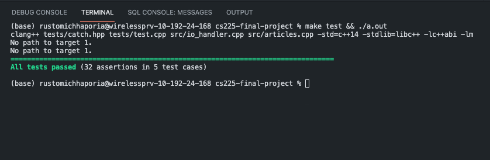
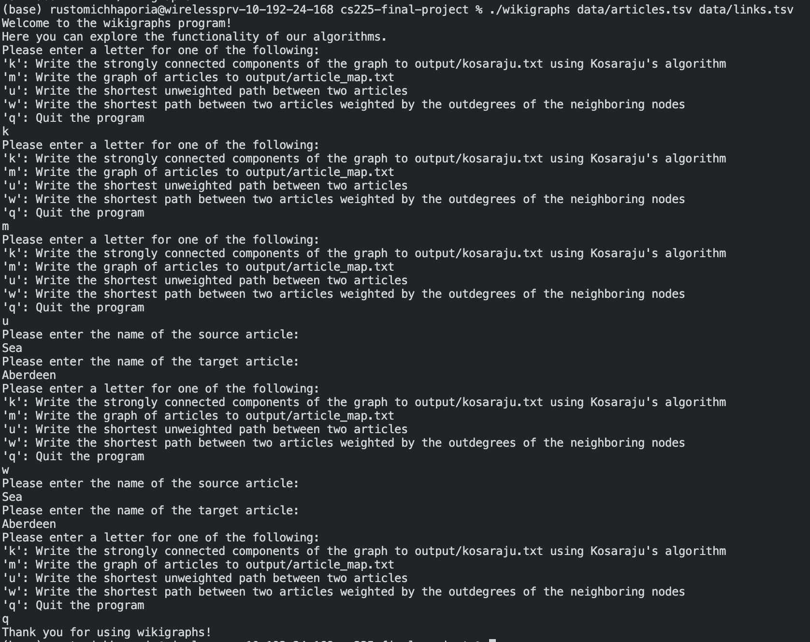

# Results Report
[Link to slides](https://docs.google.com/presentation/d/1mR-YrWMmwNtuqYl-Lq2f2oXkA4n7RvP0au77mkFdccM/edit?usp=sharing)

### Table of Contents
1. Proof of Functionality
2. Deliverables
3. Discoveries
4. Development Reflections

### Proof of Functionality

 
Proof of our tests passing all provided cases is shown and can be replicated by running the command displayed above. A demonstration of our algorithms on the full dataset is provided in the `output` directory, which contains sample output file for each of the four functions that can be run from our main function, including the output from Kosaraju's and Dijkstra's weighted and unweighthed pathfinding algorithms. To run this main function, simply enter `make && ./wikigraphs`. The commands used to generate the sample output that is committed to this repository is displayed below. 

 

### Deliverables
- Driver program
  - Simple ui offering options to run different functionality of our project
  - Produces following deliverables given parameters
- Articles map
  - Prints to a file the contents of our main data structure
  - Displays each article in the dataset and it's corresponding linked articles
- Paths
  - Prints the path from a source to a target article through the various links
  - Essentially serves as the cheat code to the Wikispeedia Game
- Kosaraju's
  - Prints all clusters of articles to a file
  - Separates different clusters from each other

### Discoveries
One of our main discoveries was from the result of running Kosaraju's on our graph
and finding that there was a single large cluster encompassing almost all the articles,
leaving only a handful in isolated clusters.

This told us a couple things about our data. First, it meant that Wikipedia, (or at least
our sample) is extremely connected. Nodes are classified in the same cluster only if there is
a path both ways (a cycle) between a node and all other nodes in the cluster. Given that all
but a few nodes were in the same cluster, and the system of links is a directed graph, the
connectivity of the data is very strong.

There were however a few caveats. We noticed that the immense connectivity of the data was a result
of certain central broad articles (e.g. Philosophy) that had two way connections between many nodes, connecting
a wide variety of articles that otherwise wouldn't link to each other. On one hand, there were a few nodes
left in isolated clusters, which we realized were likely to be articles that were newer or contained 
more niche topics that hadn't enough time to link/be linked with other articles.

### Development Reflections
**What did we learn?**
 
We faced a problem early on that we had implemented a convenient data structure for unweighted graphs,
however the path finding algorithm we had planned to implement, Dijkstra's, was really only useful
for weighted graphs. This is something fundamental we learned about Dijkstra's, and our solution was
to evaluate the weight of an edge based on the number of adjacent nodes, i.e. links, in the article
the edge pointed to.

Another thing we learned was that through the implementation of Kosaraju's, we had to transpose our graph.
Not only was it valuable experience to implement this, but it taught us more about the meaning of the
clusters that resulted from the algorithm. The immense connectivity of clusters forms from the cyclic
nature between all nodes in the cluster.

**What would we have done differently?**
 
Along the way we noticed that the shortest path function for unweighted versus weighted was
distinctly similar, and so a good implementation given our scope would be to interface
the iterator class and then make separate iterator classes for traversing weighted
versus unweighted graphs. Then we could parameterize the iterator as an argument of the
shortest path function and merge the two into a single function.

More generally, we named our variables and functions of our articles class according to the
context that we used them in, whereas looking back, we think it would have been more clear
for development to name things as they exist as part of the general data structure,
and then use contexted naming for things like our driver and main class. This way our data
structure would be repurposeable, and it would have made things clearer while developing.
